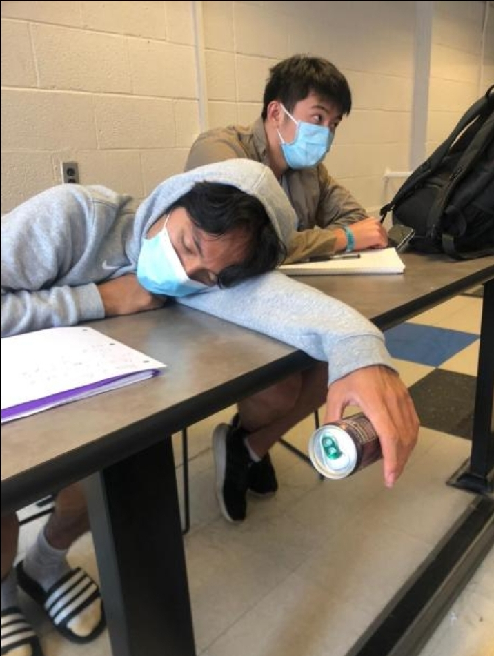
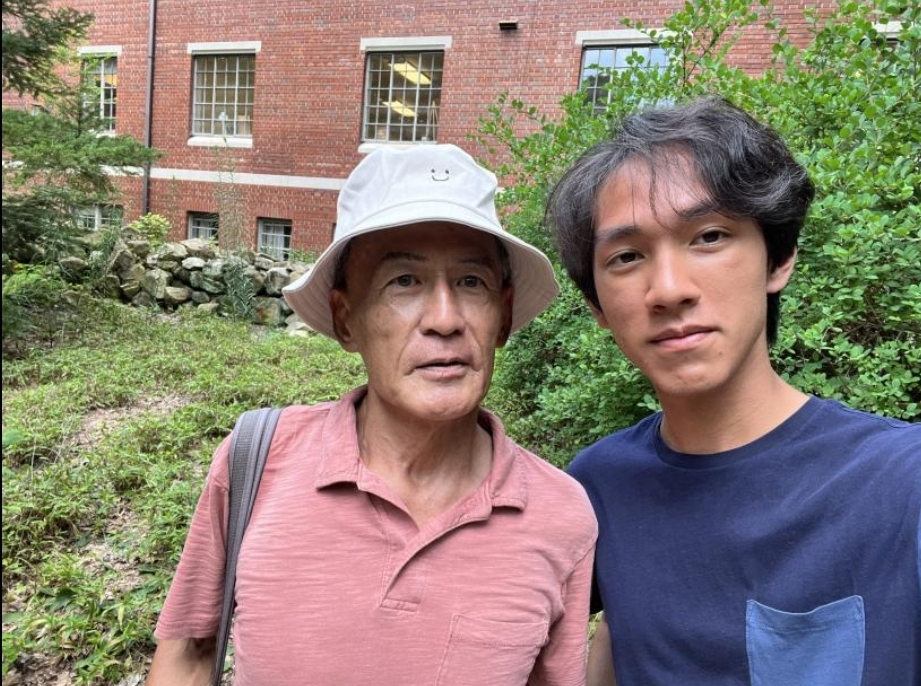

As we wrap up the final days of SSP, there are a plethora of feelings that I am
experiencing. While writing this, I am mostly feeling disconsolate– as are many
others, I assume– due to the looming idea that most of us will never see each
other again in less than 100 hours. The fact that our final report is due
tonight does not ameliorate that feeling at all. Irrespective of all the sappy
and sad events occurring, my time at SSP has been an experience that I would not
trade for any other summer; the friends that I have made here are some of the
smartest and coolest people I have met in my life, and the amount of knowledge
that I have absorbed in and out of lectures is immeasurable. (All credits for
the following sentence go to my admirable roommate, Oliver.) The amount of
material that is thrown at us in such a short time necessitates participants to
be absorbent and porous, which is why SSP seems to stand for Spongebob
SquarePants.

The idea of acronyms opens up a whole new world into what SSP actually is. Most
people would probably still call it the Summer Science Program, and maybe some
people would call it the Summer Satire Program. My personal favorite, however,
is the Summer Sleep Program (see picture below).

There are plenty more pictures that aren’t just of me, but I will choose to
exclude those as to not expose other SSPers and their semi-questionable sleeping
habits. Although academics may be advertised as the central focus of SSP, I’ve
learned more outside of the classroom/lab, whether it be from talking to friends
or a byproduct from exploring campus. UNC Chapel Hill has a very unique campus,
aside from being the first built public school in the United States. Just a few
days ago, I stumbled across the “UNC Campus Whistler.” For reference, here is an
article that talks about him:
[here](https://www.dailytarheel.com/blog/pit-talk/2015/10/use-your-mind-and-listen-to-your-heart-my-life-changing-chat-with-the-unc-campus-whistler)

Having been around the UNC campus for 13 years now, Gregory Cheng is a Taiwanese
immigrant who moved to Los Angeles in 1976. Eventually, he moved to the Chapel
Hill area and his youngest daughter even graduated from this school. I had seen
Mr. Cheng around campus a few times before, eccentrically whistling to whatever
operas he was listening to with his earbuds, and I always found it to be cute,
even if those around me found it to be weird. Fortunately, I was able to
encounter him when I was alone, and he taught me more in an hour than I could’ve
asked for in any lecture.

At first, he talked about how music helps him with self-expression. He chooses
to sing rather than play an instrument because he is a firm believer in
individual progress, and you have to construct your voice to be a good singer
whereas if you play an instrument, “you just have to learn how to play it.”

But slowly, he transitioned into a topic that will stick with me for life. Mr.
Cheng was on a tangent about what he thought the difference between wisdom and
knowledge was, and started talking about how he came across a large bunch of
college students and asked them what they thought the wisdom associated with
water was. Unsurprisingly, they all answered that the wisdom was that you should
drink water because you need it to survive. Cheng argued, though, that the
wisdom of water comes when you think about how a few miniscule droplets of water
can eventually turn into a pond, which can turn into a lake, which can turn into
a river, which turns into a sea, and eventually turns into an ocean. The main
point being that no matter how small you start, there is potential for everyone.
And to anthropomorphize water, this journey can be described from being a
droplet in the air to water in the ocean.

Slowly the conversation transitioned into how this idea played a role in his
life, especially with regards to music. Mr. Cheng was an amazing singer and in
his younger years, would be the only kid in his class who would have the
confidence to perform music like Schumann in front of large crowds of people.
And this passion for music continues even now, where he spends up to 8 hours a
day whistling for the people of the UNC campus to hear (whistling as opposed to
singing as to not bother people on campus). Another important idea he mentioned
to me was that passion is nothing without compassion. As much as he liked music,
there were and are always people who are trying to bring him down; people on
campus often stare at him in disgust or call him unsavory words. But this
doesn’t stop Mr. Cheng, because he makes an active effort to not live a life
full of hate, and instead to lead a life full of compassion.

All of these lessons that I learned from Mr. Cheng are 100 percent applicable to
my fellow SSPers. Everyone that I’ve talked to in the past 5 weeks is incredibly
capable and there is no doubt that they are all passionate. Even though I went
into SSP thinking I would be primarily dealing with academic issues, I realized
that academic rigor was usually not an obstacle. Rather, more hurdles arose from
more humanlike problems, interpersonal or not, where a sense of compassion
allowed me to get through smoother.

I want to end with my own two cents. If there is one thing that I’ve learned
during my time at SSP, it’s the difference between knowledge and wisdom. And if
you asked me to drop some of my wisdom, there are a few words I would have. Most
importantly: know how to have fun. Although academics are extremely important,
especially for this eight year portion of our life that we call high school and
college, finding time to enjoy oneself especially helps because it can serve as
a good mental break in a section of our lives where having fun has minimal
consequences.

fun picture of mr. cheng wearing my bucket hat :)
